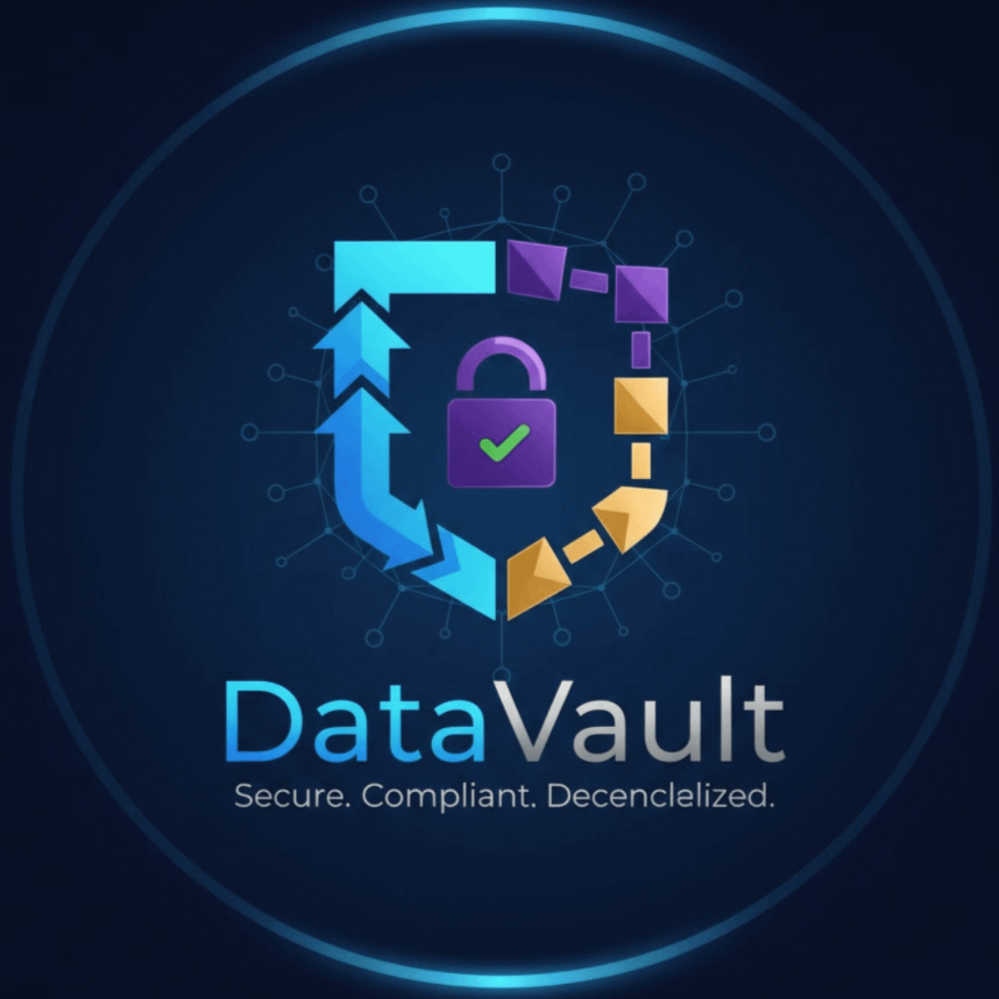

# DataVault - Decentralized Compliance Storage



## Overview
DataVault is an enterprise-grade compliance storage platform that combines Filecoin's decentralized storage with automated compliance features. Built on Filecoin Onchain Cloud, it provides regulated industries with tamper-proof, auditable storage with instant retrieval capabilities.

## 🚀 Features

- **Automated Compliance**: Built-in audit trails and regulatory proof generation
- **Warm Storage**: Fast retrieval with Filecoin Warm Storage Service
- **Streaming Payments**: Dynamic pricing with Filecoin Pay
- **Instant Access**: FilCDN-powered retrieval for audit scenarios
- **Data Integrity**: Continuous PDP verification and proof of possession
- **Enterprise Ready**: Role-based access, encryption, and compliance reporting

## 🛠 Tech Stack

### Filecoin Onchain Cloud Services
- **Synapse SDK** - Primary integration and service orchestration
- **Filecoin Warm Storage** - Fast, verifiable storage layer
- **Filecoin Pay** - Streaming payments and settlement
- **FilCDN** - High-speed content delivery
- **PDP Contracts** - Data possession verification

### Additional Technologies
- Frontend: React, TypeScript, Tailwind CSS
- Backend: Node.js, Express
- Storage: IPFS, Filecoin Network
- Smart Contracts: Solidity, Hardhat

## 📋 Prerequisites

- Node.js 16+
- npm or yarn
- Filecoin wallet with testnet FIL
- Access to Filecoin Onchain Cloud services

## 🏁 Installation

```bash
# Clone the repository
git clone https://github.com/your-username/datavault.git
cd datavault

# Install dependencies
npm install

# Set up environment variables
cp .env.example .env
# Edit .env with your configuration
```

## ⚙️ Configuration
1. Filecoin Onchain Cloud Setup:
```javascript
// src/config/synapse.js
import { SynapseSDK } from '@synapse-sdk/core';

export const synapse = new SynapseSDK({
  network: 'filecoin-testnet',
  warmStorage: true,
  paymentEnabled: true
});
```
2. Wallet Configuration:
```bash
# Add your wallet private key to .env
WALLET_PRIVATE_KEY=your_private_key_here
FILEPAY_CONTRACT_ADDRESS=0x...
WARM_STORAGE_CONTRACT_ADDRESS=0x...
```

## 🚀 Usage
### Storage with Compliance
```javascript
import { DataVault } from './src/services/datavault';

const vault = new DataVault();
const result = await vault.storeCompliantDocument(
  fileBuffer,
  'healthcare-record',
  {
    retentionPeriod: '7years',
    complianceType: 'HIPAA',
    auditTrail: true
  }
);
```
### Retrieval for Audit
```javascript
const document = await vault.retrieveForAudit(
  documentId,
  {
    auditor: 'regulatory-body',
    purpose: 'compliance-audit'
  }
);
```
### Payment Management
```javascript
const paymentStatus = await vault.getPaymentStream(
  storageAgreementId
);
```

## 🏗 Architecture
```text
┌─────────────────┐    ┌──────────────────┐    ┌─────────────────┐
│   Client App    │───▶│   DataVault API   │───▶│  Synapse SDK    │
└─────────────────┘    └──────────────────┘    └─────────────────┘
         │                       │                       │
         │                       │                       │
         ▼                       ▼                       ▼
┌─────────────────┐    ┌──────────────────┐    ┌─────────────────┐
│ Audit Dashboard  │    │ Compliance Engine│    │Filecoin Services│
└─────────────────┘    └──────────────────┘    └─────────────────┘
```

## 📁 Project Structure
```text
datavault/
├── src/
│   ├── components/     # React components
│   ├── services/       # Business logic & Filecoin integration
│   ├── contracts/      # Smart contracts
│   ├── utils/          # Utilities and helpers
│   └── types/          # TypeScript definitions
├── docs/               # Documentation
├── tests/              # Test suites
└── scripts/            # Deployment scripts
```

## 🧪 Testing
```bash
# Run unit tests
npm test

# Run integration tests
npm run test:integration

# Test Filecoin services
npm run test:filecoin
```

## 🔧 Development
1. Start development server:
```bash
npm run dev
```
2. Deploy smart contracts:
```bash
npm run deploy:testnet
```
3. Run compliance validation:
```bash
npm run compliance:check
```

## 📊 Compliance Features
- Automated Audit Trails: Every access and modification logged
- Retention Policies: Configurable data retention periods
- Proof Generation: Automated compliance proof creation
- Access Controls: Role-based data access management
- Encryption: End-to-end encryption for sensitive data

## 🆘 Support
- [Filecoin Onchain Cloud Docs](https://www.filecoin.services/)
- [Issue Tracker](https://github.com/GauravKarakoti/datavault/issues)

## 🙏 Acknowledgments
- Filecoin Onchain Cloud team
- Protocol Labs ecosystem
- Synapse SDK contributors
