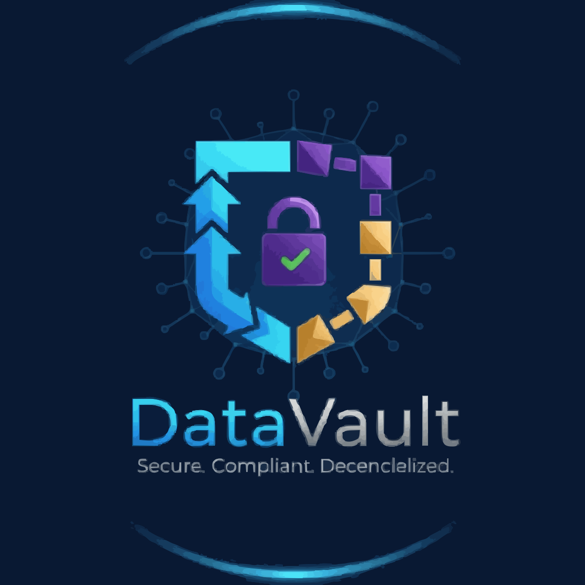

# DataVault - Decentralized Compliance Storage



## Overview
DataVault is an enterprise-grade compliance storage platform built on Filecoin. It leverages the **Synapse SDK** to interact with Filecoin's decentralized storage network, providing automated compliance features suitable for regulated industries. Key features include client-side encryption, metadata management for compliance (like retention periods), and audit trail capabilities facilitated by decentralized, tamper-proof storage with potential for fast retrieval.

## 🚀 Features

- **Client-Side Encryption**: Uses AES encryption via `crypto-js` before data leaves the browser.
- **Decentralized Storage**: Stores encrypted data on the Filecoin network via the Synapse SDK.
- **Automated Compliance Metadata**: Stores compliance requirements (regulation type, retention period) alongside data using Synapse metadata features.
- **Audit Access & Retrieval**: Allows retrieval of encrypted data for audit purposes, requiring the original passphrase for decryption.
- **Integrity Verification**: Generates and stores a SHA-256 hash of the original file for integrity checks upon retrieval.
- **Potential for Fast Retrieval**: Can utilize FilCDN via Synapse SDK options for quicker access during audits.
- **Enterprise Ready (Concept)**: UI includes role-based concepts and compliance reporting placeholders.

## 🛠 Tech Stack

### Core Filecoin Integration (via Synapse SDK)
- **Synapse SDK**: Primary library used in `src/services/SynapseService.ts` for interacting with Filecoin.
- **Filecoin Decentralized Storage**: The underlying storage network accessed via `synapse.storage.createContext()` and `storageContext.upload()`.
- **FilCDN**: Content delivery network accessed via `synapse.storage.download()` with the `withCDN: true` option.
- **(Implicit via Synapse)**: Features like PDP (Proof of Data Possession), Warm Storage, and Payments are likely handled or configured at the Synapse SDK level or backend, not directly managed in this frontend code.

### Frontend & Utilities
- Frontend: React, TypeScript, Vite, CSS
- Encryption: `crypto-js` for AES encryption and SHA-256 hashing
- UI Components: Basic React components, `lucide-react` for icons.

### Smart Contracts (Experimental/Separate)
- **Solidity/Hardhat**: Contains contracts like `ComplianceStorage.sol`.
  - **Note:** `ComplianceStorage.sol` defines structures for on-chain metadata but is **not currently integrated** into the primary upload/download flow which uses Synapse SDK's metadata.
  - `Lock.sol` is example code from Hardhat template.

## 📋 Prerequisites

- Node.js (Version specified in `package.json` engines or >=18 recommended for latest dependencies)
- npm or yarn or pnpm
- Web3 Wallet Private Key (for testnet/dev environment)
- RPC URL for Filecoin Network (e.g., Calibration testnet)

## 🏁 Installation

```bash
# Clone the repository
git clone [https://github.com/your-username/datavault.git](https://github.com/your-username/datavault.git)
cd datavault

# Install dependencies
npm install # or yarn install / pnpm install

# Set up environment variables
cp .env.example .env
# Edit .env with your private key and RPC URL
```

## ⚙️ Configuration
1. Environment Variables (`.env` file):
- `VITE_WALLET_PRIVATE_KEY`: Your wallet's private key ( NEVER commit this to Git). Used by `SynapseService.ts` to initialize the SDK.
- `VITE_RPC_URL`: RPC endpoint for the desired Filecoin network (e.g., Calibration testnet).
- `VITE_COMPLIANCE_CONTRACT_ADDRESS` (Optional): Address if deploying and integrating `ComplianceStorage.sol`. Currently unused in the main flow.

## 🚀 Usage
1. Run the Development Server:
```Bash
npm run dev
```
2. Open the App: Navigate to the local URL provided by Vite.
3. Upload:
- Select a regulatory framework.
- Choose a file.
- Enter a secure passphrase (this is critical for encryption and later decryption).
- Click "Store Compliant Document". The file will be encrypted client-side and uploaded via Synapse.
4. Audit:
- Switch to the "Audit Dashboard" tab.
- Find the document.
- Click "Audit Access".
- Enter the correct passphrase used during upload.
- Click "Decrypt & Download" to retrieve, decrypt, and download the original file. An audit trail entry is also logged locally.

## 🏗 Architecture
```plaintext
┌──────────────────┐      ┌────────────────────┐      ┌────────────────┐
│ React Components │────▶│  SynapseService.ts │────▶│   Synapse SDK  │
│ (Uploader, Dash) │      │ (Encrypt, Upload,  │      │ (@filoz/...)   │
└──────────────────┘      │  Download, Decrypt)│      └────────────────┘
         ▲                  └────────────────────┘             │
         │ (User Interaction)        │ (Calls)                 │ (Filecoin Network)
         ▼                           ▼                         ▼
┌──────────────────┐      ┌────────────────────┐      ┌────────────────┐
│   User Browser   │◀────│ Encryption Utils   │      │ Filecoin Nodes │
│                  │      │ (crypto-js)        │      │ (Storage Deals)│
└──────────────────┘      └────────────────────┘      └────────────────┘
```

## 📁 Project Structure
```plaintext
datavault/
├── public/             # Static assets
├── src/
│   ├── assets/         # Images, etc.
│   ├── components/     # React UI components (ComplianceUploader, AuditDashboard)
│   ├── context/        # React context (FilecoinContext - potentially unused/refactor)
│   ├── contracts/      # Solidity smart contracts and Hardhat config (Separate, not integrated in main flow)
│   ├── services/       # Core logic (SynapseService.ts)
│   ├── types/          # TypeScript definitions (compliance.ts)
│   ├── utils/          # Utility functions (encryption.ts)
│   ├── App.css         # Main app styles
│   ├── App.tsx         # Root React component
│   ├── index.css       # Global styles
│   └── main.tsx        # Application entry point
├── tests/              # Vitest tests (e.g., SynapseService.test.ts)
├── .env.example        # Environment variable template
├── .gitignore          # Git ignore rules
├── index.html          # Main HTML entry
├── package.json        # Project dependencies and scripts
├── tsconfig.json       # TypeScript config for app
├── tsconfig.node.json  # TypeScript config for Vite/build tooling
└── vite.config.ts      # Vite build configuration
```

## 🧪 Testing
```bash
# Run unit/integration tests with Vitest
npm run test # (Configure this script in package.json if needed)

# Test Hardhat contracts (separate from main app)
cd src/contracts
npx hardhat test
```

## 🔧 Development
1. Start development server:
```bash
npm run dev
```
2. (Optional) Deploy smart contracts:
```bash
cd src/contracts
npx hardhat ignition deploy ./ignition/modules/YourModule.js --network yourNetworkName
```

## 📊 Compliance Features
- Client-Side Encryption: Ensures data is encrypted before upload.
- Metadata Storage: Compliance type and retention period stored with data via Synapse.
- Audit Access Log: Basic local logging of retrieval actions in the dashboard.
- Integrity Hashing: SHA-256 hash stored for verification.

## 🆘 Support
- [Synapse SDK Documentation](https://github.com/FilOzone/synapse-sdk)
- [Issue Tracker](https://github.com/GauravKarakoti/datavault/issues)

## 🙏 Acknowledgments
- Filecoin & Protocol Labs ecosystem
- Synapse SDK contributors